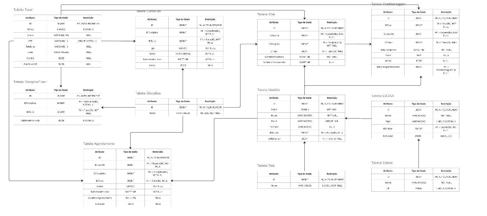

### Curso de tecnologia de banco de dados - Centro Universitário Senac
# Projeto Integrador III: Implantação de Banco de Dados 
## Grupo 04 EAD - 2024 Colaboradores
- Anderson Belarmino Santana
- Christian Arrebola Gaspar
- Paloma Costa Barros
- Raiana Rocha Oliveira
- Sabrina Mai Nakaichi Perdiz
  
## Resumo

 Este trabalho implementa um banco de dados para o segmento educacional, mais especificamente reforço escolar. O banco de dados implementado suporta um sistema
 multiplataforma que possibilite a interação entre os tutores e tutorados através de videochamadas e conversas por mensagens, com a opção de upload de conteúdos úteis, como
 resumos, artigos, vídeos etc.
  
 
 Para mais detalhes checar o [texto completo do projeto](https://github.com/Rairocha/projeto_integrador_implantacao_bd/blob/main/projeto_intergrador.pdf)
 

## Instruções de carregamento do BD
O banco de dados foi desenvolvido no MySQL 8.0 cuja a instalação pode ser feita pelo [site de downloads do mysql](https://dev.mysql.com/downloads/installer/)
 
Na linha de comando do mysql ou utilizando o MySQL Workbench rodar o [arquivo de criação de tabelas DDL](scripts/PI_senac_DDLs.sql)
 
Em seguida rodar o [arquivo de população de dados](scripts/PI_senac_DMLs.sql) 
 
Em caso de dúvidas o [vídeo de demostração](video/video_proposta.mp4) tem o passo a passo da implementação.
 

## Diagrama de Entidade-Relacionamento
Após a implementação do banco de dados será possível trabalhar com as tabelas no modelo de entidade e relacionamento
 
    

 

